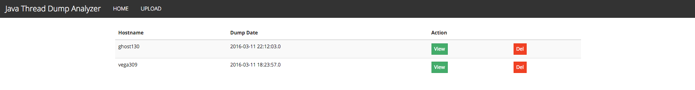
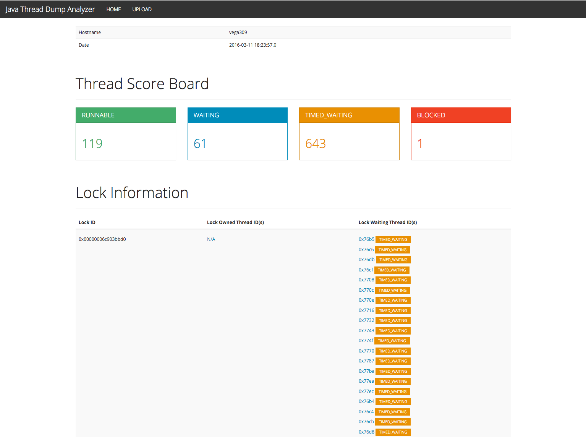

# Java Thread Dump Analyzer

## About

You can analyze your java thread dump file with this project.
It shows all thread's status and link about lock information.

## Configuration

### Set properties files

#### Common
- Filename : src/main/resources/application.properties
```
spring.datasource.driverClassName=com.mysql.jdbc.Driver
spring.datasource.username=<Username of your database>
spring.datasource.password=<Password of your database>
spring.datasource.validation-query=SELECT 1

multipart.maxFileSize: 1024MB
multipart.maxRequestSize: 1024MB
```
ex)
```
spring.datasource.driverClassName=com.mysql.jdbc.Driver
spring.datasource.username=username
spring.datasource.password=passwd
spring.datasource.validation-query=SELECT 1

multipart.maxFileSize: 1024MB
multipart.maxRequestSize: 1024MB
```

#### Development 
- Filename : src/main/resources/application-devel.properties
```
spring.datasource.url=<Your database url in development environment>
config.baseurl=<URL of your server in development environment>
```
ex)
```
spring.datasource.url=jdbc:mysql://dev.db.com/data
config.baseurl=http://infra.domain.com
```


#### Production
- Filename : src/main/resources/application-production.properties
```
spring.datasource.url=<Your database url in production environment>
config.baseurl=<URL of your server in production environment>
```

### Create tables

#### thread_info
You have to create thread_info table in mysql
```
mysql> CREATE TABLE thread_info (hostname varchar(100), timestamp varchar(50), date timestamp, name varchar(100), tid varchar(50), nid varchar(50), state varchar(50), raw_data text,  primary key (hostname, timestamp, tid, nid));
```

#### lock_info
You have to create lock_info table in mysql
```
mysql> CREATE TABLE lock_info (hostname varchar(100), timestamp varchar(50), lock_if varchar(50), tid varchar(50), nid varchar(50), state varchar(50), owned int, primary key (hostname, timestamp, tid, nid));
```

## How to Build

You make jar file from mvn package. And just execute it.
```
mvn package
```

## How to Run

Just execute jar file.
```
java -jar java-thread-analyzer-0.0.1-SNAPSHOT.jar -Dspring.profiles.active=<mode>
```
ex)
```
java -jar -Dspring.profiles.active=production -Xms4096m -Xmx4096m ./java-thread-analyzer-0.0.1-SNAPSHOT.jar
```

## How to Use

### Web Mode

You can use this project with web interface.

#### Screen Shots
1. Main Page


2. View Page


### API Mode

You make java thread dump with jstack and use curl command.
```
[root@server ~]# jstack -l 12345 > /tmp/$(hostname)_dump
[root@server ~]# curl -F "dumpFile=@/tmp/$(hostname)_dump" -F "hostname=$(hostname)" http://infra.domain.com/api/v1/dump/java/upload
http://infra.domain.com/dump/java/$(hostname)/1451972358000
```
And you open response url with web brower.

## License

This software is licensed under the [Apache 2 license](https://github.com/kakao/hbase-tools/blob/master/LICENSE.txt), quoted below.

Copyright 2015 Kakao Corp. http://www.kakaocorp.com

Licensed under the Apache License, Version 2.0 (the "License"); you may not use this project except in compliance with the License. You may obtain a copy of the License at http://www.apache.org/licenses/LICENSE-2.0.

Unless required by applicable law or agreed to in writing, software distributed under the License is distributed on an "AS IS" BASIS, WITHOUT WARRANTIES OR CONDITIONS OF ANY KIND, either express or implied. See the License for the specific language governing permissions and limitations under the License.
